# Ethan-milestone-1-Argoll-Logistics

A Static front end website for a Logistic company. This website provides a basic understanding of what the company is about, the history, the services offered and how to contact the company.

This website was built to help Argoll Logistics to build a stronger online presence and generate more leads that the company can work with the turn into value generation sales of service.

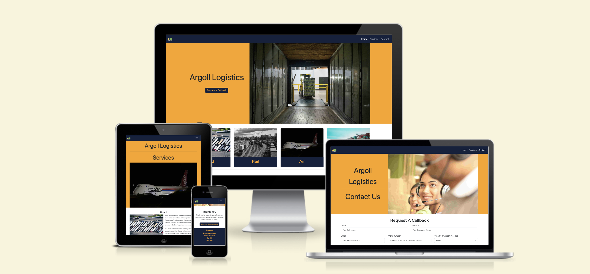

---

## CONTENTS

* [User Experience](#user-experience-ux)
  * [User Stories](#user-stories)

* [Design](#design)
  * [Colour Scheme](#colour-scheme)
  * [Typography](#typography)
  * [Imagery](#imagery)
  * [Wireframes](#wireframes)

* [Features](#features)
  * [General Features on Each Page](#general-features-on-each-page)
  * [Future Implementations](#future-implementations)
  * [Accessibility](#accessibility)

* [Technologies Used](#technologies-used)
  * [Languages Used](#languages-used)
  * [Frameworks, Libraries & Programs Used](#frameworks-libraries--programs-used)

* [Deployment & Local Development](#deployment--local-development)
  * [Deployment](#deployment)
  * [Local Development](#local-development)
    * [How to Fork](#how-to-fork)
    * [How to Clone](#how-to-clone)

* [Testing](#testing)

* [Credits](#credits)
  * [Code Used](#code-used)
  * [Content](#content)
  * [Media](#media)
  * [Acknowledgments](#acknowledgments)

---

## User Experience (UX)

#### Site Owner Goals

Argoll Logistics would like to attract and retain business and build a bigger online presence.

#### External User Goals

The site user’s are new and returning customers who want to know about the company and the logistic solutions Argoll Logistics can provide via it’s services.

### User Stories

`First Time Customer`

| Goals |
| :--- |
| As a new customer I want to be able to find out more about Argoll Logistics. |
| As a new customer I want to be able to easily navigate the website. |
| As a new customer I want to be able to easily find the contact details|
| As a new customer I want to find out what services Argoll Logistics offers. |

`Returning Customer`

|  Goals | 
| :--- | 
| As a returning customer I want to know more about your schedule for all your services. |
| As a returning customer I want to be able to find the details of my local office and their contact details. |

`Larger Customer`

| Goals |
| :--- | 
| As a customer who is a large company I want to know the history and current statistics of the company to see if you would be able to handle the quantity I want to ship. |

## Design

### Colour Scheme

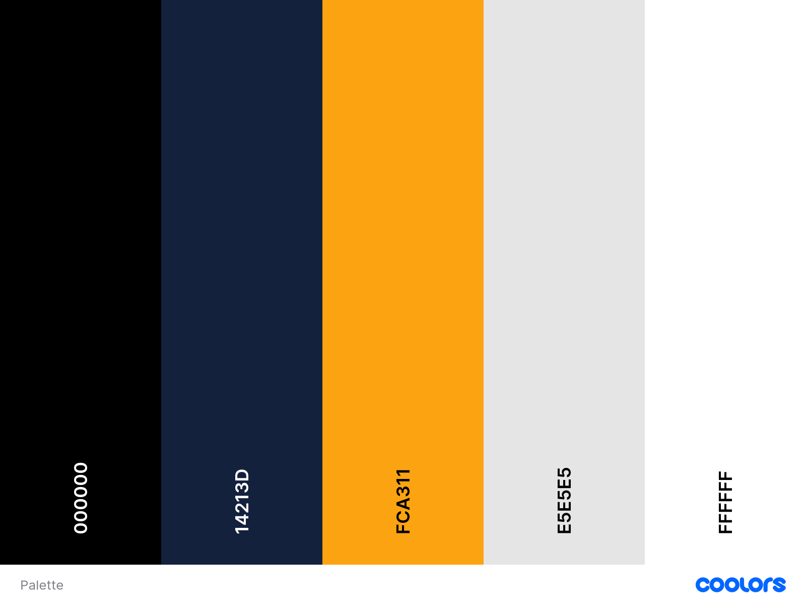

The colour palette was created using the [Coolors](https://coolors.co/) website.

I chose the above colours to give the website a modern, clean and aestheticly pleasing website with a nice contract to give the user and owner a feeling of confidence that the website is built by a professional.

### Typography

In this project I have imported fonts from [Google Fonts](https://fonts.google.com/). The fonts I choose are as follows.

1. [Montserrat](https://fonts.google.com/specimen/Montserrat)
2. [Hind](https://fonts.google.com/specimen/Hind)

Please note that the above fonts maybe shown in a writing system that is not the Latin writing system. When you click on the link please make sure that the 'writing system' is set to Latin to see the font in English.

* I choose the above fonts as they give the website a professional business feel with clean, crisp and modern look.
* I have included all variations that available for each font to give me the most versiatility on the website.

### Imagery

I have used images that convey information through said images. By using these images it allows for a user who may not have industry knowledge to easily be able to use the wesite as they will give the user a well known visiual that will allow them to pick the option that they want and not to get lost within the written information they may not want.

All images used on the website are from [Unsplash](https://unsplash.com/) website. I have credited each image aurthor in the [Credits](#credits) Section.

### Wireframes

Please find the wireframe designs for the home, services and contact us pages in mobile, tablet and desktop to show the full responsiveness built in from the start of the project below.

* [Home Page](Docs/wireframes/home-page/Home-Page.png)
* [Services Page](Docs/wireframes/service-page/Service-Page.png)
* [Contact Us Page](Docs/wireframes/contact-page/Contact-Page.png)
* [Thank You Page](Docs/wireframes/thank-you-page/Thank-You-Page.png)

## Features

The Website consists of 4 pages, the website has a home page, services page, contact and success page.

As this is the first deployment of the website I wanted to make sure that it contained all the important information to allow the user to understand and hopefully send through their information to begin building a business relationship.

All four pages contain the following features.

#### Navigation

The Navigation bar is one of the main features which allows the user to navigate through the website with ease. The navbar is fully connected to all pages on the website.

#### Footer

The footer is another feature which seen on all pages. The footer hold important information for user such as the address, social links and quick contact details, this information makes it easier for the user to contact us without having to use the contact page.

#### Favicon

The favicon can be seen on the navbar as the link to home on the right hand side and also on the tab are of the web browser, this give the website a small but important change which gives the user the feeling that the website was built professionaly.

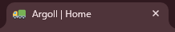

### General features on each page

#### Home Page

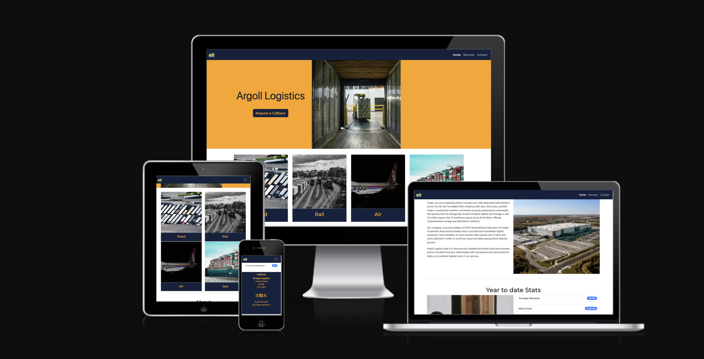

The home page contains the following.

Hero Image with company name.

The hero image gives a clear understanding to the user as to the company's area of business as well as having logistics in the name of the company.

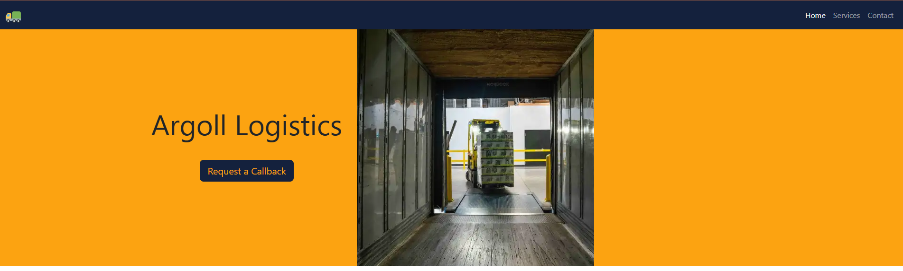

Card Section

Card section that is linked to the service page, each card is linked to the section of the service page to give the user a shortcut to the information they need.

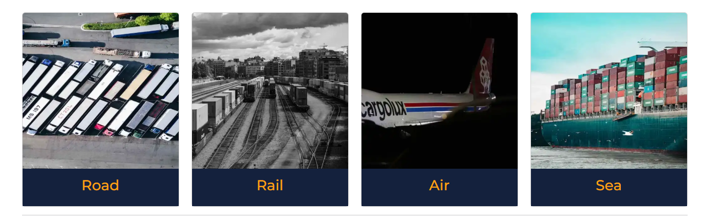

About and history Section

The about and histroy section gives the user a small piece of information about the company and it's history. This allows the user to understand the size and length of time the company has been doing business.

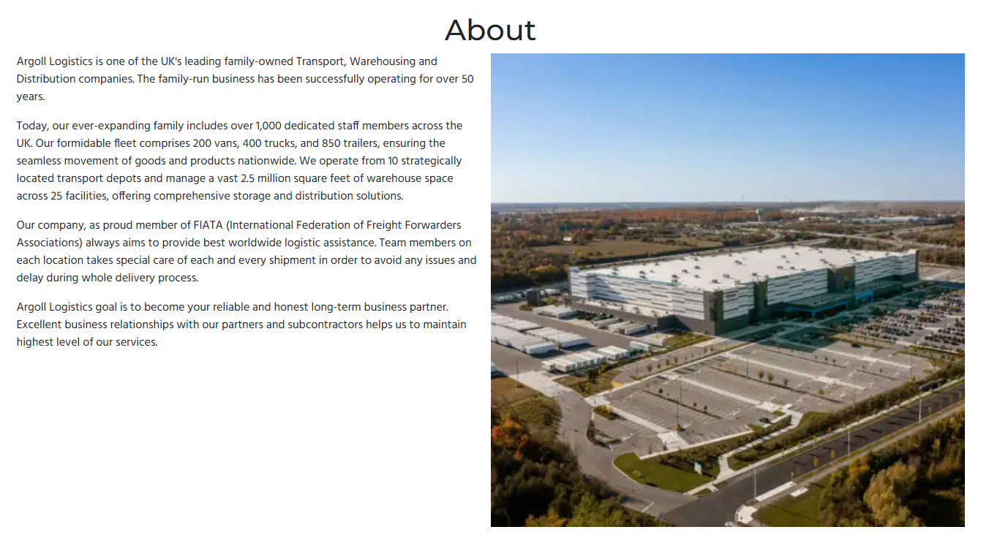

#### Services Page

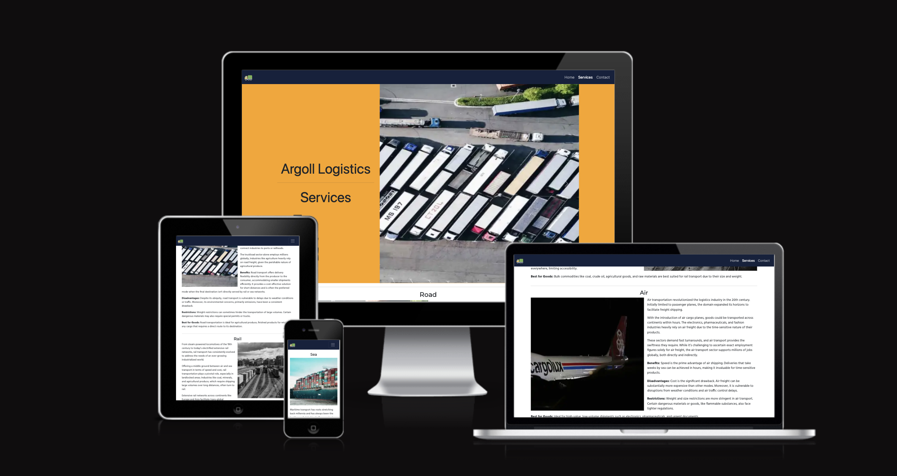

The services page contains the following.

Hero Section with Carousel

The hero section on the service page has changed from the home page but still carries the company name but also has the page title to give clear understanding of what page the user is on.

The carousel that has been added to the services page uses the same images from the card section on the home page to give a feeling of continuity to the user.

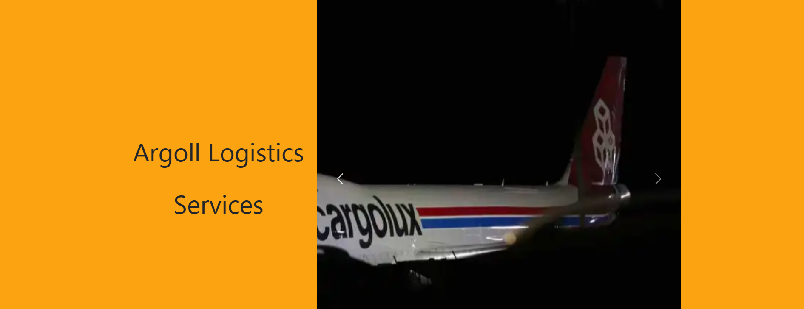

Services info section

The services infomation section has a seperate section for each type of transport service offered (road, rail, air and sea). Each section has the image from the card section on the home page which is linked to the that section's infomation. Again this is to give the customer a feeling of knowing and continuity.

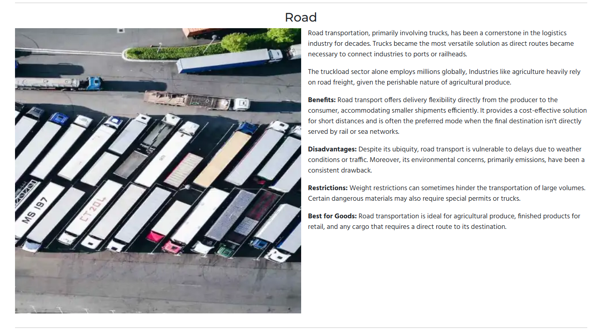

#### Contact us Page

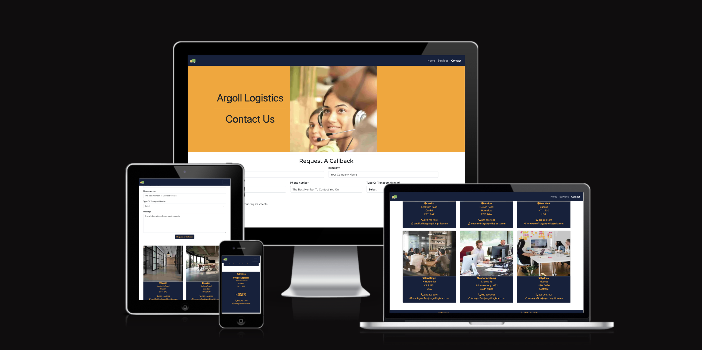

The services page contains the following.

Hero Image with company name and page title

The hero section on the contact page has the same design as the other hero sections on the website but with a different image to give the customer an easy visiual aid as to what page they are on.

Form Section

The form section of the page give the user the option to request a callback. With information provide will allow the company staff to begin the conversation with the user to start building a business relationship.

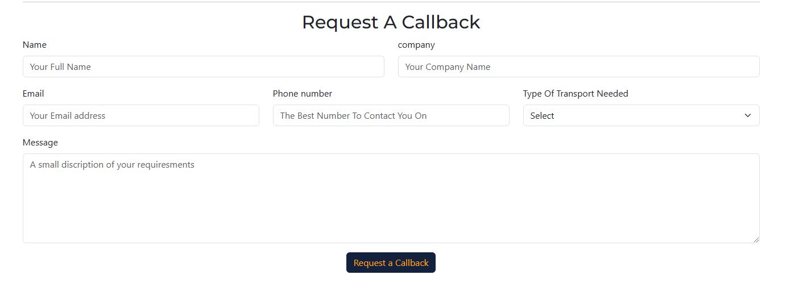

Office Address Section

The office address section is a basic card layout with all the relevant information for each of the company's offices, this allows the user to also contact their local office.

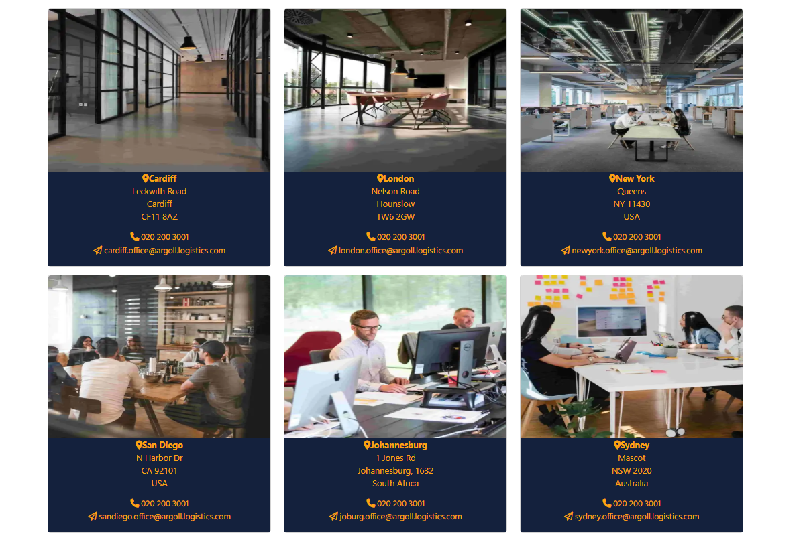

#### Success Page

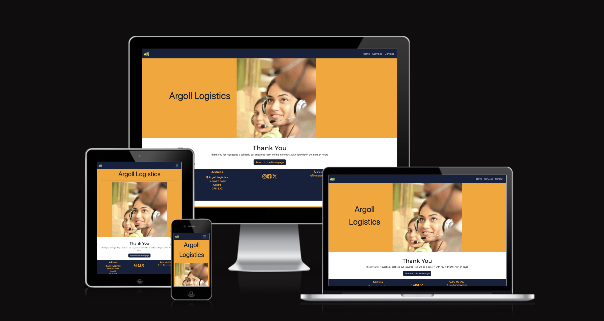

The success page contains the following.

Hero Image

The hero section on the success page is the same as the contact page as this is only an extension of the contact page form.

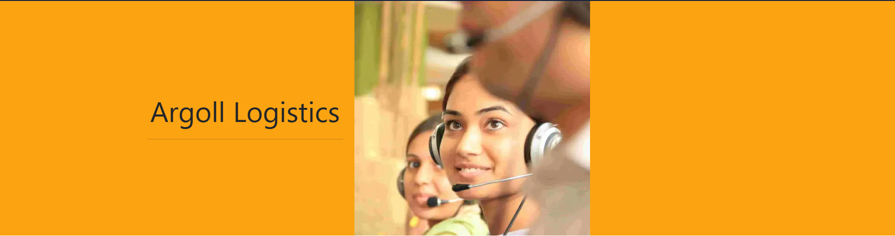

Thank You Section

The thank you section on the success page has a small thank you message to let the user know the information in the form has been sent to the company. There is also a button to return to the home page.

### Future Implementations

I would like to add a schedule page to give the user important information about how long it takes for their deliveries to get to certain countries. I would do this by building a form that once complete would pull information from a database and only show the relevant data to the user.

I would also like to add a map with pins on it to show the offices locations in an easy to understand format on the contact page.

### Accessibility

I have used icons and added aria-labels on the footer for the social media links, I also added aria-label to the logo on the navbar. This allows screen readers to understand what the icons are for.

Contrast checker For colour scheme used

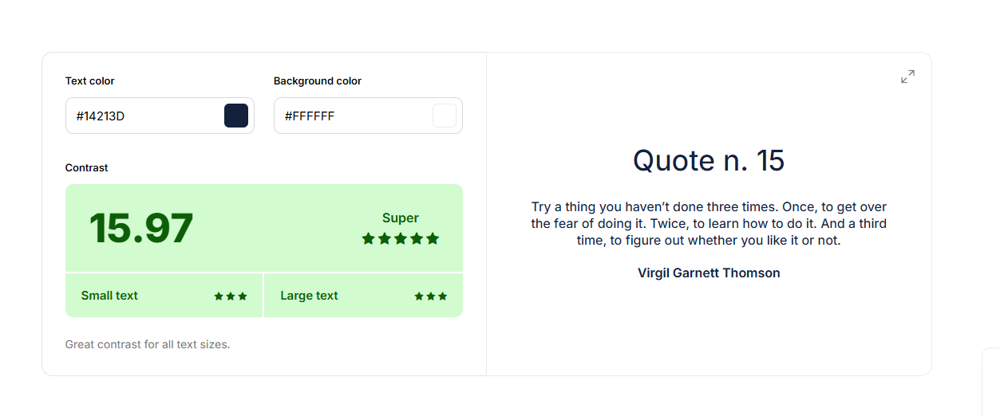

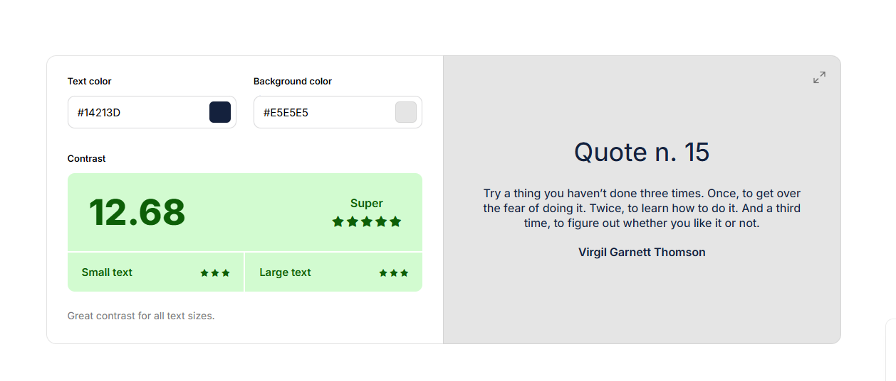

## Technologies Used

### Languages Used

HTML and CSS were used to create this website.

### Frameworks, Libraries & Programs Used

Balsamiq - Used to create wireframes.

Git - For version control.

Github - To save and store the files for the website.

Bootstrap Version 5 - The framework for the website. Code for the navigation bar, carousel, cards and form were used and modified. Additional CSS styling was also implemented in style.css.

Google Fonts - To import the fonts used on the website.

Font Awesome - For the iconography on the website.

Google Dev Tools - To troubleshoot and test features, solve issues with responsiveness and styling.

[Compressor](https://compressor.io/) To compress images.

[Birme](https://www.birme.net/) To resize images and change to webp format.

[Favicon.io](https://favicon.io/) To create favicon.

[Am I Responsive?](http://ami.responsivedesign.is/) To show the website image on a range of devices.

### Languages Used

The languages used in this project is HTML and CSS.

The site is deployed using GitHub Pages - [Argoll Logistics](https://ethans241.github.io/Ethan-Milestone-1-Argoll-Logistics/).

To Deploy the site using GitHub Pages:

1. Login (or signup) to Github.
2. Go to the repository for this project, [Ethan Skidmore | Argoll Logistics](https://github.com/ethans241/Ethan-Milestone-1-Argoll-Logistics).
3. Click the settings button.
4. Select pages in the left hand navigation menu.
5. From the source dropdown select main branch and press save.
6. The site has now been deployed, please note that this process may take a few minutes before the site goes live.

### Local Development

#### How to Fork

To fork the repository:

1. Log in (or sign up) to Github.
2. Go to the repository for this project, [Ethan Skidmore | Argoll Logistics](https://github.com/ethans241/Ethan-Milestone-1-Argoll-Logistics).
3. Click the Fork button in the top right corner.

#### How to Clone

To clone the repository:

1. Log in (or sign up) to GitHub.
2. Go to the repository for this project, [Ethan Skidmore | Argoll Logistics](https://github.com/ethans241/Ethan-Milestone-1-Argoll-Logistics).
3. Click on the code button, select whether you would like to clone with HTTPS, SSH or GitHub CLI and copy the link shown.
4. Open the terminal in your code editor and change the current working directory to the location you want to use for the cloned directory.
5. Type 'git clone' into the terminal and then paste the link you copied in step 3. Press enter.

## Testing

[Testing Documentation](testing.md)
  
Use this part of the README to link to your TESTING.md file - you can view the example TESTING.md file [here](milestone1-testing.md)

## Credits

👩🏻‍💻 View an example of a completed Credits section [here](https://github.com/kera-cudmore/BookWorm#Credits)

The Credits section is where you can credit all the people and sources you used throughout your project.

### Content

The information was taken from two logistics websites.

The about and history section was taken from [Owens-Group]{https://www.owensgroup.uk/about}. The reason for using this contant on my website is that Argoll Logistics is a fictional company and this website will never be used by a real business.

The information on the services page was taken from [Inbound-Logistics](https://www.inboundlogistics.com/article/transportation-in-logistics/). I used this content as this information is general knowledge and would not come under copyright law and as explained in the above parapgraph this is a fictional company. 

###  Media

Hero image - Photo by [Elevate](https://unsplash.com/photos/yellow-and-black-forklift-during-daytime-dI-aXC7DWpQ?utm_content=creditCopyText&utm_medium=referral&utm_source=unsplash)

Road image - Photo by [Nigel Tadyanehondo](https://unsplash.com/photos/aerial-photography-of-freight-truck-lot-GOD2mDNujuU?utm_content=creditCopyText&utm_medium=referral&utm_source=unsplash)

Rail image - Photo by [Albert Stoynov](https://unsplash.com/photos/a-black-and-white-photo-of-a-train-yard-DJOa90oJ_sE?utm_content=creditCopyText&utm_medium=referral&utm_source=unsplash) 

Air Image - Photo by [Irakli Pichkhaia](https://unsplash.com/photos/a-large-jetliner-sitting-on-top-of-an-airport-tarmac-6KN4gjpsrPQ?utm_content=creditCopyText&utm_medium=referral&utm_source=unsplash)

Sea Image - Photo by [Mika Baumeister](https://unsplash.com/photos/a-large-cargo-ship-loaded-with-lots-of-containers-WqZwkrBuZIE?utm_content=creditCopyText&utm_medium=referral&utm_source=unsplash)

About Image - Photo by [Point3D Commercial Imaging Ltd.](https://unsplash.com/photos/an-aerial-view-of-a-large-building-xd4dqv1n2pk?utm_content=creditCopyText&utm_medium=referral&utm_source=unsplash)

Stats Image - Photo by [Annie Spratt](https://unsplash.com/photos/selective-focus-photography-of-people-sits-in-front-of-table-inside-room-sggw4-qDD54?utm_content=creditCopyText&utm_medium=referral&utm_source=unsplash)

Contact Image - Photo by [Charanjeet Dhiman](https://unsplash.com/photos/woman-in-black-headphones-holding-black-and-silver-headphones-mHusyBu4bxM?utm_content=creditCopyText&utm_medium=referral&utm_source=unsplash)

Cardiff Image - Photo by [Nastuh Abootalebi](https://unsplash.com/photos/hallway-between-glass-panel-doors-yWwob8kwOCk?utm_content=creditCopyText&utm_medium=referral&utm_source=unsplash)

London Image - Photo by [Nastuh Abootalebi](https://unsplash.com/photos/photo-of-dining-table-and-chairs-inside-room-eHD8Y1Znfpk?utm_content=creditCopyText&utm_medium=referral&utm_source=unsplash)

New York - Photo by [LYCS Architecture](https://unsplash.com/photos/man-and-woman-sitting-on-table-U2BI3GMnSSE?utm_content=creditCopyText&utm_medium=referral&utm_source=unsplash)

San Diego - Photo by [Redd Francisco](https://unsplash.com/photos/people-sitting-on-chair-5U_28ojjgms?utm_content=creditCopyText&utm_medium=referral&utm_source=unsplash)

Joburg - Photo by [Arlington Research](https://unsplash.com/photos/man-sitting-in-front-of-table-Kz8nHVg_tGI?utm_content=creditCopyText&utm_medium=referral&utm_source=unsplash)

Sydney - Photo by [Arlington Research](https://unsplash.com/photos/man-sitting-in-front-of-table-Kz8nHVg_tGI?utm_content=creditCopyText&utm_medium=referral&utm_source=unsplash)
  
###  Acknowledgments

I would like to thank the following for the help they have given me on the project.

My mentor Graeme for the helping with the solid advise and make sure I am on the right track for this project.

Kera Cudmore for the brilliant [document](https://github.com/kera-cudmore/readme-examples) that help me build this very document and without such help I would not have been able to build such a great readme and testing document.

I would also like to thank code institute for the outstanding course documentation which helped me when I was stuck and able to go back over to give my mind a refresh.

Last but not least I would like to thank the coding community on slack and other forums which give me a answers to many issue while working on this project that I may not have been able to pass without their knowledge.
