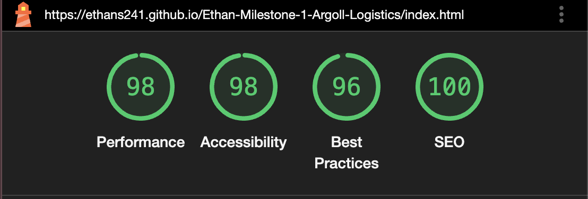
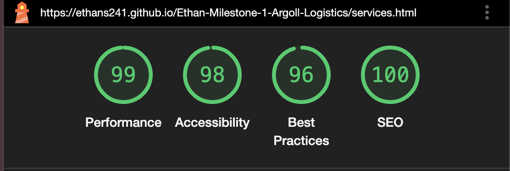
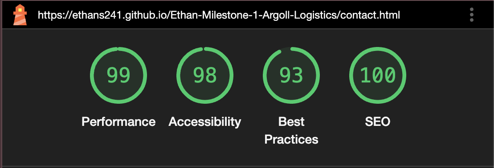
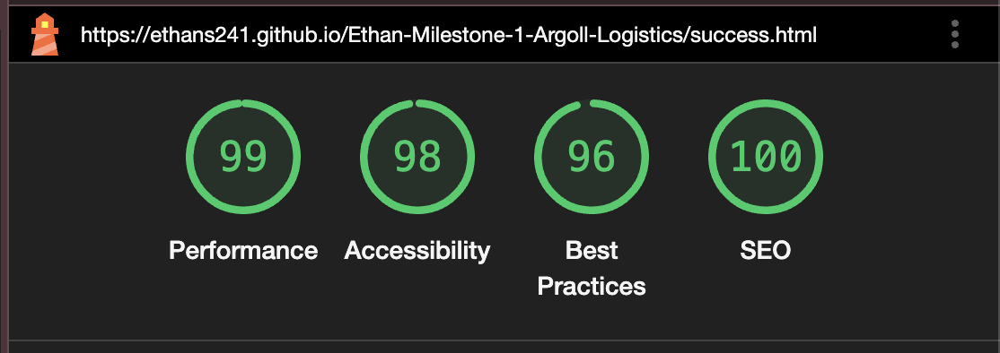
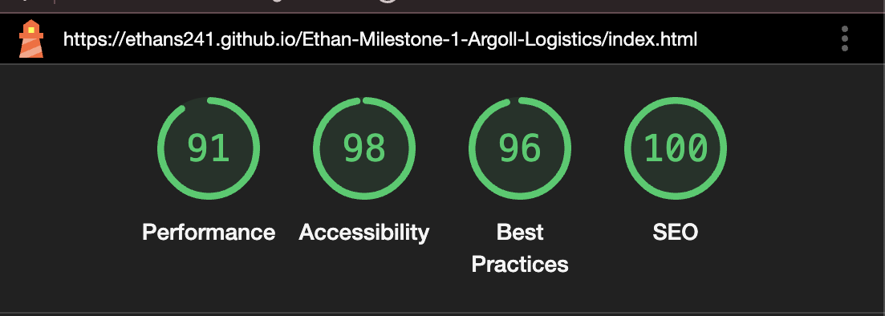
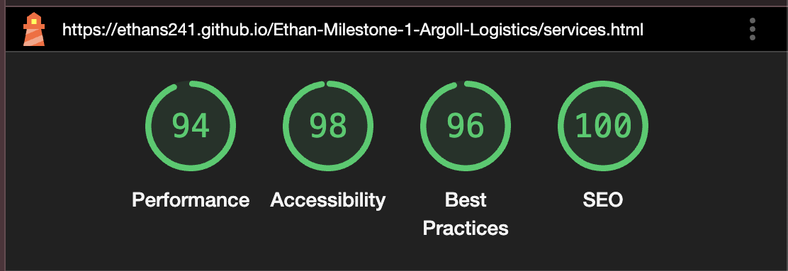
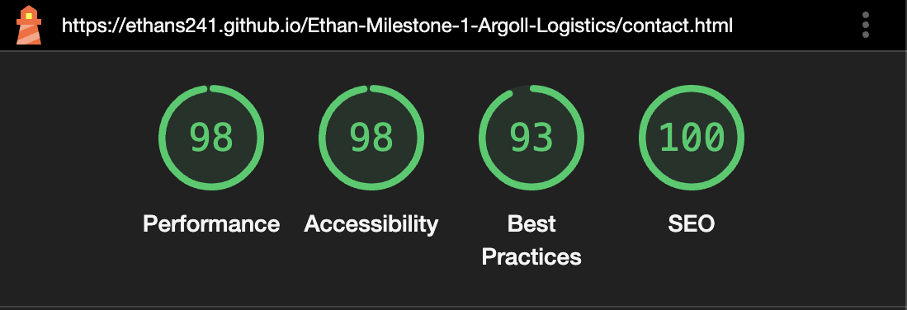
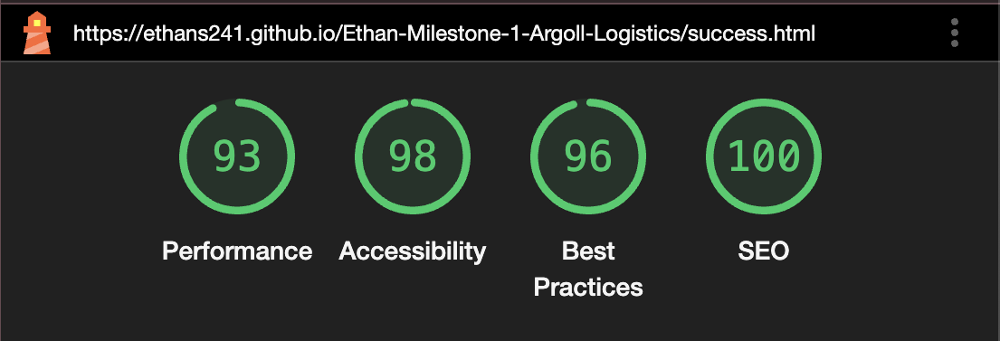

# Ethan-milestone-1-Argoll-Logistics -  Testing

Visit the deployed site: [Argoll Logistics](https://ethans241.github.io/Ethan-Milestone-1-Argoll-Logistics/).

- - -

## CONTENTS

* [AUTOMATED TESTING](#automated-testing)
  * [W3C Validator](#w3c-validator)
  * [Lighthouse](#lighthouse)
* [MANUAL TESTING](#manual-testing)
  * [Testing User Stories](#testing-user-stories)
  * [Real World Testing](#real-world-testing)

Testing was ongoing throughout the entire build. I utilised Chrome developer tools whilst building to pinpoint and troubleshoot any issues as I went along.

During development I made use of google developer tools to ensure everything was working correctly and to assist with troubleshooting when things were not working as expected.

I have gone through each page using google chrome developer tools to ensure that each page is responsive on a variety of different screen sizes and devices.

- - -

## AUTOMATED TESTING

### W3C Validator

[W3C](https://validator.w3.org/) was used to validate the HTML on all pages of the website. It was also used to validate the CSS.

* [index.html](Docs/testing/W3C-index.png) - Passed.
* [services.html](Docs/testing/W3C-services.png) - Passed.
* [contact.html](Docs/testing/W3C-contact.png) - Passed.
* [success.html](Docs/testing/W3C-success.png) - Passed.

* [style.css](Docs/testing/CSS-style.png) - Passed, no errors found.

- - -

### Lighthouse

I used Lighthouse within the Chrome Developer Tools to test the performance, accessibility, best practices and SEO of the website.

### Desktop Results

All pages of the site are achieving a score of 93 or better across the 4 categories.

### Mobile Results

All pages of the site on mobile devices are achieving a score of 91 or better across the 4 categories.

- - -

## MANUAL TESTING

### Testing User Stories

`First Time Customer`

| Goals | Actions |
| :--- | :--- |
| As a new customer I want to be able to find out more about Argoll Logistics. | I placed an about/history section on the home page. |
| As a new customer I want to be able to easily navigate the website. | I added a navigation bar to all pages that gives the user an easy way to navigate the website. |
| As a new customer I want to be able to easily find the contact details. | I added a footer with basic contact details for the company. |
| As a new customer I want to find out what services Argoll Logistics offers. | I added a card section with the four services that Argoll Logistics offers. These card are linked to the services page and takes the customer to the section of information they need. |

`Returning Customer`

| Goals | Actions |
| :--- | :--- | 
| As a returning customer I want to know more about your schedule for all your services. | Sadly I was unable to add this feature but it is not necessary for the deployment of the website. This will be added in a future deployment. |
| As a returning customer I want to be able to find the details of my local office and their contact details. | I added a card section on the contact page with local office contact details to give the user the option to contact their local office. |

`Larger Customer`

| Goals | Actions |
| :--- | :--- | 
| As a customer who is a large company I want to know the history and current statistics of the company to see if you would be able to handle the quantity I want to ship. | I added a statistics section on the home screen to show users that argoll logistics can deal with any and all requirements a user may have. |

- - -

### Real World Testing

Real World testing was performed on the following devices:

* Laptop:
  * Macbook Air M2 2022 14 inch screen
* Tablet
  * iPad Pro
* Mobile Devices:
  * iPhone 13 Pro Max.
  

Each device tested the site using the following browsers:

* Google Chrome
* Safari

Additional testing was taken by friends and family on a variety of devices and screen sizes. They reported no issues
