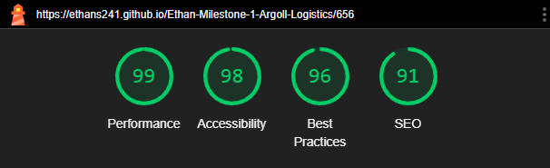
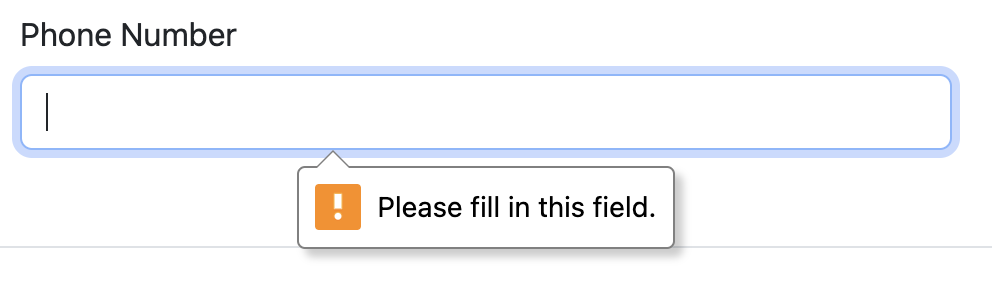

# Ethan-milestone-1-Argoll-Logistics -  Testing

Visit the deployed site: [Argoll Logistics](https://ethans241.github.io/Ethan-Milestone-1-Argoll-Logistics/).

- - -

## CONTENTS

* [AUTOMATED TESTING](#automated-testing)
  * [W3C Validator](#w3c-validator)
  * [Lighthouse](#lighthouse)
* [MANUAL TESTING](#manual-testing)
  * [Testing User Stories](#testing-user-stories)
  * [Manual Link Testing](#manual-link-testing)
  * [Real World Testing](#real-world-testing)

Testing was ongoing throughout the entire build. I utilised Chrome developer tools whilst building to pinpoint and troubleshoot any issues as I went along.

During development I made use of google developer tools to ensure everything was working correctly and to assist with troubleshooting when things were not working as expected.

I have gone through each page using google chrome developer tools to ensure that each page is responsive on a variety of different screen sizes and devices.

- - -

## AUTOMATED TESTING

### W3C Validator

[W3C](https://validator.w3.org/) was used to validate the HTML on all pages of the website. It was also used to validate the CSS.

* [index.html](docs/testing/w3c-index.png) - Passed.
* [services.html](docs/testing/w3c-services.png) - Passed.
* [contact.html](docs/testing/w3c-contact.png) - Passed.
* [success.html](docs/testing/w3c-success.png) - Passed.
* [404.html](docs/testing/w3c-404.png) - Passed.

* [style.css](docs/testing/css-style.png) - Passed, no errors found.

- - -

### Lighthouse

I used Lighthouse within the Chrome Developer Tools to test the performance, accessibility, best practices and SEO of the website.

### Desktop Results

All pages of the site are achieving a score of 93 or better across the 4 categories.

### Mobile Results

All pages of the site on mobile devices are achieving a score of 91 or better across the 4 categories.

- - -

## MANUAL TESTING

### Testing User Stories

`First Time Customer`

| Goals | Actions |
| :--- | :--- |
| As a new customer I want to be able to find out more about Argoll Logistics. | I placed an about/history section on the home page. |
| As a new customer I want to be able to easily navigate the website. | I added a navigation bar to all pages that gives the user an easy way to navigate the website. |
| As a new customer I want to be able to easily find the contact details. | I added a footer with basic contact details for the company. |
| As a new customer I want to find out what services Argoll Logistics offers. | I added a card section with the four services that Argoll Logistics offers. These card are linked to the services page and takes the customer to the section of information they need. |

`Returning Customer`

| Goals | Actions |
| :--- | :--- | 
| As a returning customer I want to know more about your schedule for all your services. | Sadly I was unable to add this feature but it is not necessary for the deployment of the website. This will be added in a future deployment. |
| As a returning customer I want to be able to find the details of my local office and their contact details. | I added a card section on the contact page with local office contact details to give the user the option to contact their local office. |

`Larger Customer`

| Goals | Actions |
| :--- | :--- | 
| As a customer who is a large company I want to know the history and current statistics of the company to see if you would be able to handle the quantity I want to ship. | I added a statistics section on the home screen to show users that argoll logistics can deal with any and all requirements a user may have. |

- - -

### Manual Link Testing

#### __Global__

- - -

__Navigation bar__

__Expected__

I expect the nav bar to link all the pages together and give easy navigation of the website. On each respected page the navbar will show what page you are on as shown below.

Home page - Home option is highlighted to show current page.

Services page - Services option is highlighted to show current page.

Contact page - Contact option is highlighted to show current page.

Success page - no option is highlighted to show current page as this an extention of the contact page. This could confuse the user and a easy fix would be to have the contact option highlighted.

Please note that the navigation bar is not on the 404 page.

__Results__

The navigation bar on all the pages works as designed and as expected.

- - -

__Footer__

__Expected__

The social media links open up to the respective home page in a new tab.

__Results__

Worked as intended.

- - - 

#### __Home Page__

- - -

__Hero call to action button__

__Expected__

The user will click on the button which will take them to the contact page.

__Results__

The button worked as expected.

- - -

__Services cards__

__Expected__

The user can click anywhere on the card and it will take them to the services page and the respective section as stated below.

* Road card = sevices.html#road-section
* Rail card = sevices.html#rail-section
* Air card = sevices.html#air-section
* Sea card = sevices.html#sea-section

__Results__

Worked as expected and as designed. One small issue I have noticed is when you click on the card and you arrive at the correct section the title of said section is not visable.

- - -

#### __Services Page__

At this current deployment there is no links on the services page except for the global links tested above. As stated in the [readme document](README.md#future-implementations) future implementations section I would like to add a form which when submitted would show the relevant information and I would have a call to action on the services page to take the user to this form.

- - -

#### __Contact Page__

- - - 

__Form__

- - -

__Form validation__

The form has full validation as shown below.

* 
* 
* 
* 
* 
* 
* 

The below show the accepted form which will allow the user to click on the button to submit.

- - -

__Form Button__

- - -

__Expected__

*When the user tries to submit the form with one or more of the form fields being filled in the form validation gives the user a prompt to fill in the missing fields. 
*When form validation has been met the user will be able to submit the form via the form button and will be taken to the success page so the user knows the form has be passed onto the company.

__Results__

Works as expected.

- - -

#### __Success Page__

- - -

__Return to Home Button__

__Expected__

When user clicks on the button it will return them to the home page.

__Results__

Works as inteded.

- - -

#### __404 Page__

- - -

__404 Button__

__Expected__

When the user clicks the button a modal pops up.

__Results__

Works as expected.

- - -

__404 Modal Button__

__Expected__

When the user clicks the button it will take them back to the home page.

__Results__

Works as intended.

### Real World Testing

Real World testing was performed on the following devices:

* Laptop:
  * Macbook Air M2 2022 14 inch screen
* Tablet
  * iPad Pro
* Mobile Devices:
  * iPhone 13 Pro Max.
  

Each device tested the site using the following browsers:

* Google Chrome
* Safari

Additional testing was taken by friends and family on a variety of devices and screen sizes. They reported no issues
